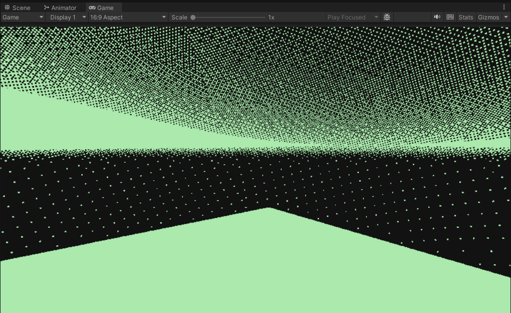

# Dithering Shader 🎨

[](https://unity.com)
[](LICENSE)

A customizable post-processing dithering shader for Unity that reduces the color palette to two user-defined colors, creating a stylized, retro, or limited-color aesthetic. Perfect for achieving cel-shaded, monochrome, or indie game visual styles.


*Example of the dithering effect applied to a scene*

---

## ✨ Features

- 🎨 **Two-Color Palette** – Map the camera output to any two colors of your choice
- 📊 **Multiple Dithering Patterns** – Includes Bayer matrix, blue noise, Obra Dinn-style, and other classic algorithms
- ⚡ **Real-time Post-Processing** – Applied as a camera effect for instant visual feedback
- 🎮 **Demo Scene Included** – Ready-to-use scene to test and tweak settings
- 🔧 **Fully Customizable** – Adjust pattern size, intensity, and color selection

---

## 🖼️ Dithering Patterns

| Pattern | Description |
|--------|-------------|
| **Bayer Matrix** | Ordered dithering with a structured grid pattern |
| **Blue Noise** | Random-like pattern with natural film grain appearance |
| **Color Ramp** | Smooth transition with discrete steps |
| **Obra Dinn** | Inspired by the *Return of the Obra Dinn* visual style |
| **Threshold** | Simple binary cutoff |

---

## 🚀 Getting Started

### Prerequisites
- Unity 2020.3 or later
- Post-processing stack (or built-in camera effect support)

### Installation

1. **Clone the repository**
   ```bash
   git clone https://github.com/yourusername/dithering-shader.git
